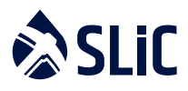

  

# 
Guide to Digital Asset Refining

## 
– Know Your Hashrate

Know Your Hashrate (https://www.knowyourhashrate.com/)

---
# Preliminary KYH Code of Conduct
To improve operational procedures, and move the Mining industry closer to full compliance with generally accepted best practice, a voluntary Code of Conduct is shared below. This Code of Conduct is released as an Open Source artifact on GitHub and will evolve from a high level set of principles, to a mature Code of Conduct when the
peer review has been completed:

## Policy elements:
- Principle 1: Wind down the practice of anonymity for mining registration within twelve months, with December 2021 as the deadline for compliance.
- Principle 2: Collect generally accepted KYC data from third-party miners, as they relate to Mining Pool Country of Incorporation or the Mining Node used by Miners.
- Principle 3: Share KYC data when requested by Law Enforcement or National / Federal Courts.
- Principle 4: Adopt or fork **Mining KYH Standard 42** and publish via KnowYourHashrate.com or other data interchange platforms .i.e InterPlanetary File System (IPFS). IPFS is built around a decentralized system of user-operators who hold a portion of the overall data, creating a resilient system of file storage and sharing.
- Principle 5: Launch an education program on the Mining Pool website about
   1. Why these changes are taking place;
   2. The increasing risk of criminal prosecution for non-compliance - especially for Open Loop integration.

